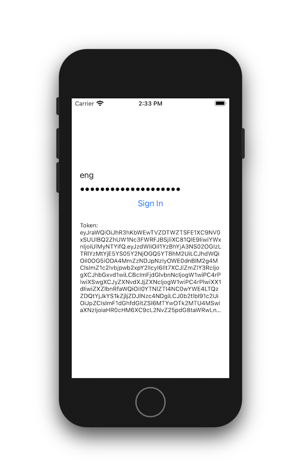

# CognitoAuthSample

This iOS project demonstrates using the [Amplify SDK for iOS](https://docs.amplify.aws) to authenticate with Cognito.

To run it, open CognitoAuthSample.xcworkspace (not the xcodeproj).

You can find the configuration for the user pool in awsconfiguration.json and amplifyconfiguration.json.
